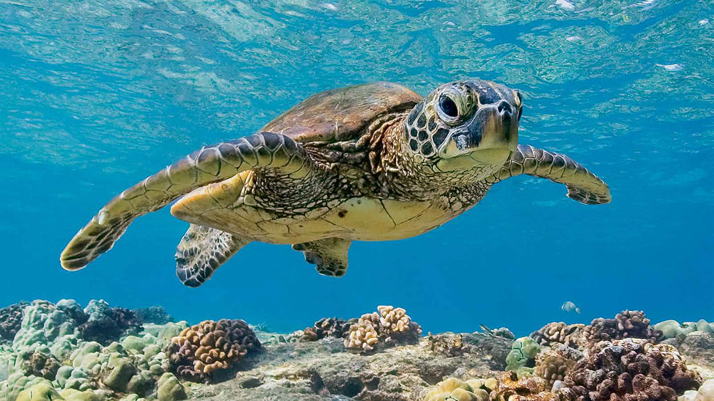

# project2
<!DOCTYPE html>
<head>
<link rel='stylesheet' type='text/css' href='style.css'>
</head>
<body>

 
	

		

	

	
The Endangered Sea Turtle
		  
		 These sea turtles are being endangered because of the things we do. We need to make a change. Save the turtles. Click on the images below to learn more.
	

	
 Enviromental Effects
		 
	

	
 Social Justice
		 
	

    
 Historical Facts
		 
	

 </body>
  
  <!DOCTYPE html>
 <link rel='stylesheet' type='text/css' href='style.css'></head>
 
<body>

	
 History <a href="file:///C:/Users/sadie_cooper/Documents/computer%20sci%20proj%202/page1.html"> Link.</a>

	
 Problem <a href="file:///C:/Users/sadie_cooper/Documents/computer%20sci%20proj%202/page2.html"> Link.</a>

	
 Solution <a href="file:///C:/Users/sadie_cooper/Documents/computer%20sci%20proj%202/page3.html"> Link.</a>

    
 hello <a href="file:///C:/Users/sadie_cooper/Documents/computer%20sci%20proj%202/page2.html"> Link.</a>

	
 word <a href="file:///C:/Users/sadie_cooper/Documents/computer%20sci%20proj%202/page4.html"> Link.</a>

  </body>
	
 <!DOCTYPE html>
 <link href="style.css" type="text/css" rel="stylesheet">
<html>
<head>

</head>
 <body>
 

 <h1> History </h1>
 

 

  <table>
  	<tr> <th>  </th>
	</th> </tr>
  
	<tr> <th>Information... </th>
	
	<tr> <th> <a href="file:///C:/Users/sadie_cooper/Documents/computer%20sci%20proj%202/new.html">Back</a> </th>
		</table>
		

  </body>
  </html>

<!DOCTYPE html>
 <link href="style.css" type="text/css" rel="stylesheet">
<html>
<head>

</head>
 <body>
 

 <h1> Enviromental Effects</h1>
 

 

  <table>
  	
	<tr> <th>There are multiple things going on and why these Sea Turtles are so endangered. The first problem is them being killed for their eggs, meat, skin and shells. The next problem is their enviroment being destroyed by us, the people. This is becausse of things like plastic and fishing gear. The third problem is climate change, which effects their nesting sites, causing the eggs to be affected.</th>
	
	<tr> <th> 
	  <a href="file:///C:/Users/sadie_cooper/Documents/computer%20sci%20proj%202/index.html">Back</a> </th>
		</table>
		

  </body>
  </html>
  <!DOCTYPE html>
 <link href="style.css" type="text/css" rel="stylesheet">
<html>
<head>

</head>
 <body>
 

 <h1> Historical Facts </h1>
 

 
	
 <table>
	<tr> <th>Sea are one of the oldest creatures on earth that haven't changes for 110 millio years. They are air breathing reptiles, made for life in the sea. They are very large and can grow up to 6 feet.They have very large flippers allowing them to go deep down and swim far distanes. Once male turtules are nested they go into the ocean and never return to the shore again, unlike female turtles that return to lay their eggs. There are seven diffeent types of sea turtles. They tend to resurface each hour to breathe, after being submerged under water. The female turtles crawl ashore and dig to then lay about 100 eggs, that are about the size of ping pong balls. </tr> </th>
	<tr> <th> 
	 <a href="file:///C:/Users/sadie_cooper/Documents/computer%20sci%20proj%202/index.html">Back</a> </th>
</table>
		

  </body>
  </html>
<!DOCTYPE html>
 <link href="style.css" type="text/css" rel="stylesheet">
<html>
<head>

</head>
 <body>
 

 <h1> Social Justice </h1>
 

 

  <table>
	<tr> <th>There are multiple ways we can stop these Sea Turtles from dying an beign endangered. One way is to stop using plastic. Instead of using a plastic water bottle, maybe get a reusable one. Another way we can help is by participating in beach clean ups so that you can help clean up things going in the ocean like trash, that the turtles can get stuck in. The most simple way is by keeping the beach clean and picking up after yourself before you leave the beach. </th>
	
	<tr> <th>  
	 <a href="file:///C:/Users/sadie_cooper/Documents/computer%20sci%20proj%202/index.html">Back</a> </th>
		</table>
		

  </body>
  </html>
<!DOCTYPE html>
 <link href="style.css" type="text/css" rel="stylesheet">
<html>
<head>

</head>
 <body>
 
 

 <h1> History </h1>
 

 

  <table>
  	<tr> <th>  </th>
	</th> </tr>
  
	<tr> <th>Information... </th>
	
	<tr> <th> <a href="file:///C:/Users/sadie_cooper/Documents/computer%20sci%20proj%202/index.html">Back</a> </th>
		</table>
		

  </body>
  </html>

 .grid {
	width: 100%;
	grid-template-columns: 1fr 1fr;
	grid-template-rows: default default default;
	display: grid;
	grid-gap: 3px;
	font-size: 45px;
}

img {
	width:500px; 
	height: 300px;
}

.item1{
	border: black solid 7px;
	font-size: 45px;
	grid-column-start: 1;
	grid-column-end: 3;
}
.item2{
	border: black solid 7px;
	
}
.item3{
	border: black solid 7px;

}
.item4{
	border:black solid 7px;
	grid-column-start: 1;
	grid-column-end: 3;
} 

 body {
	 color: black;
	 background-color: #d3cffa;
 }
 
 p {
	 font-family: arial;
 }
 
 table {
	 width: 100%;
 }
 
 th, td {
	 border: 5px solid black;
	 width: 49%;
	 text-align: center;
	 height: 400px;
	 font-size: 30px 
 }
  table {
	  width: 100%;
  }
  
  th, td {
	 border: 5px solid black;
	 width: 49%;
	 text-align: center;
	 height: 400px;
  }
  
  
  
